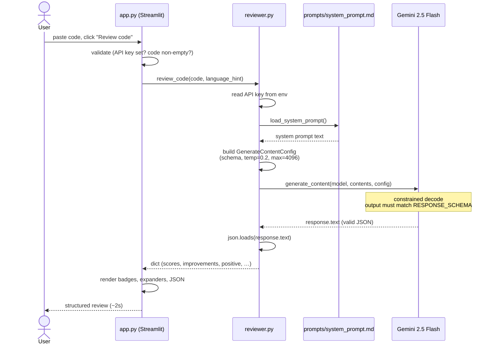
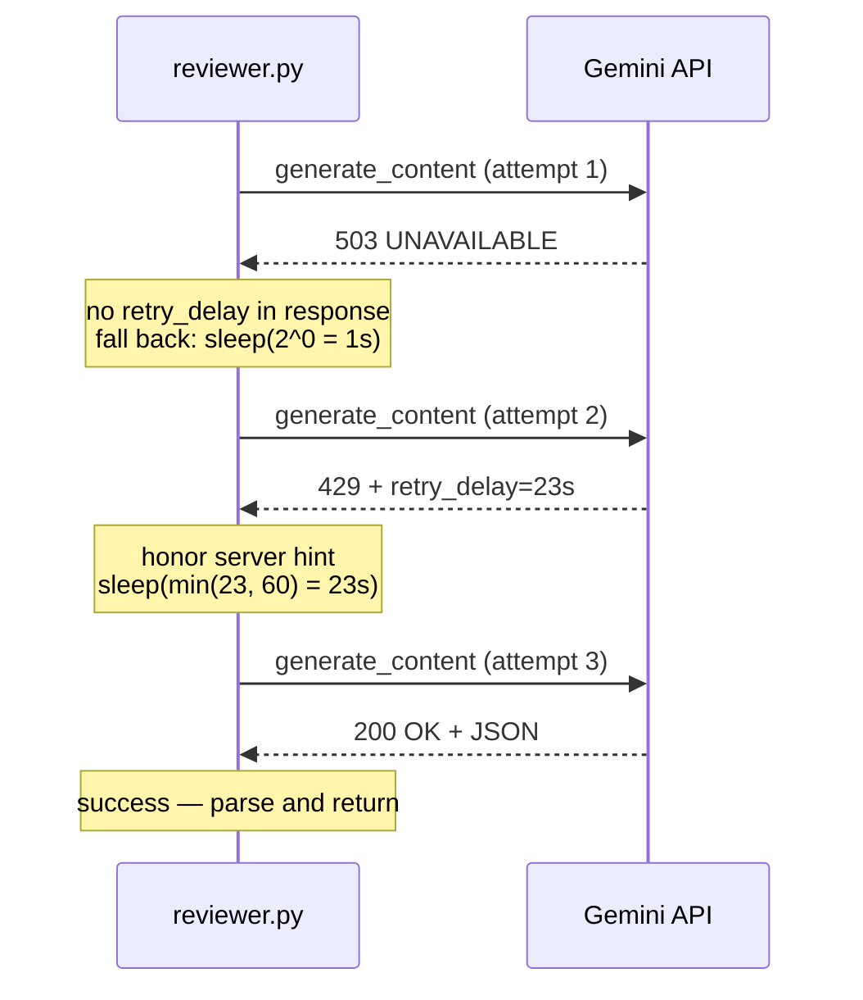
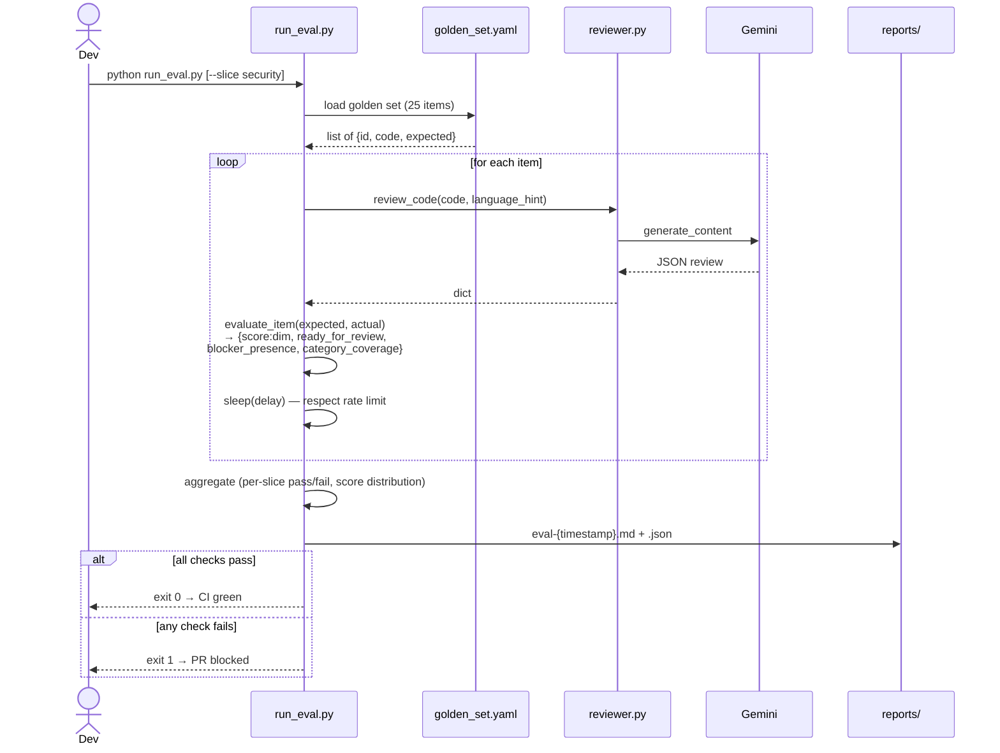
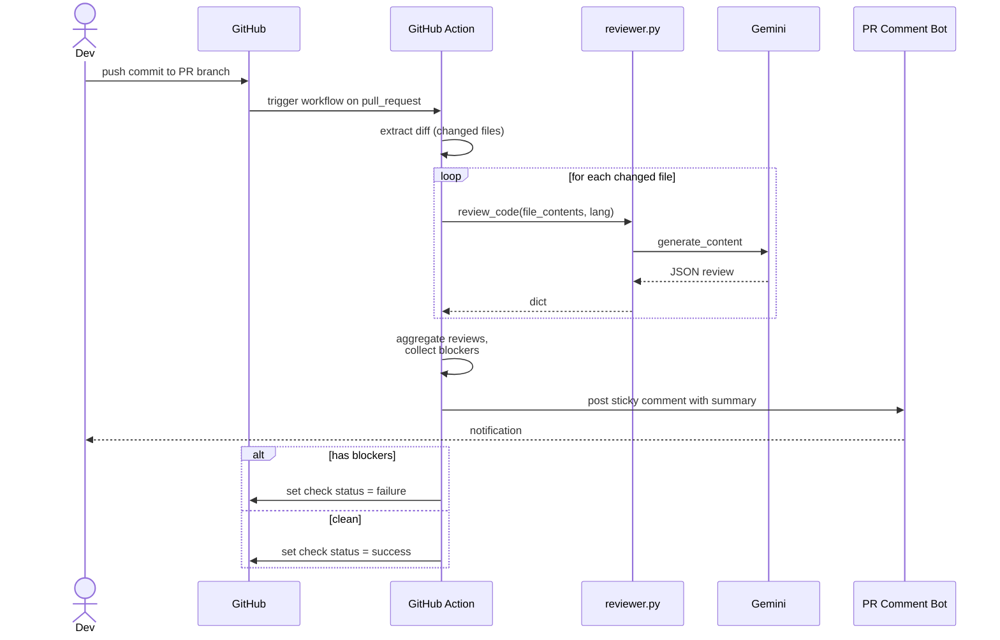

# Architecture & Code Walkthrough

Four modules + an eval harness, one external dependency. Whole thing is ~500 lines of code.

```
┌────────────────────────────────────────────────────────────────────┐
│                          User's Browser                             │
│                    (Streamlit-rendered HTML)                        │
└─────────────────────────────┬──────────────────────────────────────┘
                              │  HTTP (Streamlit websocket)
                              ▼
┌────────────────────────────────────────────────────────────────────┐
│  app.py — Streamlit UI                                              │
│  ─────────────────────                                              │
│  • Sidebar: API key, language hint, sample picker                   │
│  • Main: code textarea + Review button                              │
│  • Result panel: scores, improvements, positive note, raw JSON      │
│  • State: per-session env vars, no persistence                      │
└─────────────────────────────┬──────────────────────────────────────┘
                              │  review_code(code, language_hint)
                              ▼
┌────────────────────────────────────────────────────────────────────┐
│  reviewer.py — Business logic                  ◄──── evals/run_eval.py
│  ──────────────────────────                          (CI gate, same    │
│  • Loads system_prompt.md (rubric + schema + tone)    entry point)     │
│  • Builds GenerateContentConfig with response_schema                │
│  • Retries on 503/429, honors server-supplied retry_delay           │
│  • Parses JSON, returns dict (or error dict on failure)             │
└─────────────────────────────┬──────────────────────────────────────┘
                              │  google-genai SDK
                              ▼
┌────────────────────────────────────────────────────────────────────┐
│  Google Generative Language API                                     │
│  ───────────────────────────────                                    │
│  model: gemini-2.5-flash                                            │
│  constraint: response_mime_type=application/json                    │
│              response_schema=RESPONSE_SCHEMA                        │
│  → JSON is structurally guaranteed at decode time                   │
└────────────────────────────────────────────────────────────────────┘
```

## Module by module

### `prompts/system_prompt.md` — The IP

This is the most important file. Everything else is plumbing. It defines:

- **Role**: "senior staff engineer, polyglot, runs before human review"
- **Three dimensions**: readability, structure, maintainability — each scored 1–5
- **Rubric anchors** for each score (5 = production-ready, 1 = reject) — without anchors, models cluster at 3 ("everything looks fine")
- **Output schema** (also enforced by `response_schema` in code, but stating it in the prompt helps the model self-correct)
- **Rules**: exactly 3 improvements, specific positive note (no generic praise), ready-for-review gate only blocks on correctness/security
- **Tone**: direct, kind, technical — no hedging

The prompt is loaded fresh from disk on every call so it can be hot-swapped without restarting the app — useful for iterating on the rubric in production.

### `reviewer.py` — The LLM client

```python
def review_code(code, language_hint=None) -> dict:
    # 1. Get API key
    # 2. Initialize Gemini client
    # 3. Load system prompt from disk
    # 4. Build user message (code + optional language hint)
    # 5. Configure: response_schema, temperature=0.2, max_tokens=4096
    # 6. Try up to 3 times, exponential backoff on 503/429
    # 7. Parse JSON → return dict
```

**Three production patterns worth noting:**

1. **Schema-constrained output**: `response_schema=RESPONSE_SCHEMA` forces Gemini to emit JSON that matches the schema *at decode time*. No "please return JSON" in the prompt — the model is structurally constrained. This eliminates the most common LLM failure mode in production (malformed JSON → downstream crash).

2. **Temperature 0.2**: Reviews should be deterministic-ish. Same code on Tuesday and Wednesday should not get different scores. Low temperature trades creativity for consistency, which is what you want from a reviewer.

3. **Retry only on transient errors, honor server hints**: Loop retries on 503 (overloaded) and 429 (rate limit). When the response includes a `retry_delay` hint (Gemini does this), the retry honors it instead of doing blind exponential backoff — capped at 60s. Fails fast on actual bugs (auth, malformed request). Distinguishing transient vs. terminal errors *and* using server-supplied timing is what separates a real production client from a `time.sleep(5)` hack.

### `app.py` — The UI

Pure Streamlit, ~130 lines. Three responsibilities:

1. **Settings sidebar**: API key (password input, session-only), language hint dropdown, sample picker
2. **Code input pane**: textarea, "Review code" button
3. **Result pane**: summary line → color-coded score badges → ready/blocked banner → expandable improvements with priority emoji + category + fix + code example → positive note → collapsed raw JSON

The presentation is intentional: humans glance at the badges to decide whether to bother reading further, then dive into the high-priority improvement if scores are low. The raw JSON is there so a power user (or downstream tool) can grab the structured data.

### `samples/` and `sample_output.json`

Three demo snippets across Python / TypeScript+React / Go and the cached review outputs. Lets a reviewer who skims the repo see what the model actually produces without running anything.

### `evals/` — Regression test harness

The reviewer's prompt *is* the product, so it gets a test suite. Layout:

```
evals/
├── golden_set.yaml          # 25 curated snippets + expected outcomes
├── run_eval.py              # runner: review each, check, aggregate, report
└── reports/                 # markdown + JSON outputs (committed for diffing)
    └── baseline.md
```

**Golden set composition** — chosen to cover four distinct reviewer paths:

| Slice | Items | What it tests |
|---|---:|---|
| `bug-fix` | 14 (7 pairs) | Catches the bug *and* doesn't nag once fixed — paired data gives both signals from one item |
| `security` | 6 | `ready_for_human_review: false` path; blocker recall on OWASP-style issues (SQLi, command injection, path traversal, weak crypto, insecure deserialize) |
| `clean` | 3 | Doesn't false-positive on idiomatic code (dataclasses with types, context manager, Protocol-typed handler) |
| `style` | 2 | Distinguishes style nits (magic numbers, god function) from real blockers — these should score low but *not* gate review |

**Four check types per item**:

1. `score:<dim>` — actual score for `readability` / `structure` / `maintainability` falls inside the expected range
2. `ready_for_review` — the gate flag matches expected (true for style, false for security)
3. `blocker_presence` — blockers array is non-empty when expected, empty when not
4. `category_coverage` — at least one expected issue category (correctness/security/readability/…) appears in the improvements

The runner exits with **code 1 on any failure** → drop it into a GitHub Action and prompt changes that regress get blocked at PR time.

**Why this matters for an FDE-AI role**: every "agentic AI" customer engagement starts with the question "how do you know it still works after you tune the prompt?" An eval harness is the answer. Without it, every prompt edit is a gamble.

---

## Sequence diagrams

### 1. Happy path — single review



### 2. Retry path — Gemini overloaded (honors server retry hint)



Failure modes that bypass retry: `401` (bad API key), `400` (malformed request), `JSONDecodeError` (model returned non-JSON despite schema — rare, returns an `error` dict immediately so the UI can surface the raw output).

### 3. Eval run — regression-test the reviewer



### 4. Production extension — GitHub Action wiring

This isn't built yet, but it's the obvious next step and reviewers will ask. The schema-first design is what makes it cheap to add:



---

## Design trade-offs (the parts a reviewer will push on)

| Trade-off | Choice | Why |
|---|---|---|
| Schema enforcement: prompt-only vs. response_schema | `response_schema` | Eliminates parse errors at decode time, not "ask nicely" |
| Model: Flash vs. Pro | Flash | Per-PR latency matters; 4–5x faster, 10x cheaper, quality is sufficient for style review |
| Temperature: 0 vs. 0.2 | 0.2 | Pure-0 can collapse to template-y outputs; 0.2 keeps tiny variation in phrasing without scoring drift |
| Reviewer-as-prompt vs. reviewer-as-agent | Prompt | One-shot review needs no tool calls or memory; agent overhead would add latency without value |
| State: session vs. persistent | Session-only | Reviews are stateless. No DB needed. Move to persistence only when you want history/eval. |
| Sync vs. streaming | Sync | UI is already fast (~2s). Streaming would add complexity for negligible UX gain. |

## What I'd build next (in priority order)

1. ~~**Eval harness**~~ — **done**, see `evals/`. Next iteration: expand to 100 snippets across more languages, run each 3x and require 2/3 pass to absorb stochasticity, track per-run variance, wire into a GitHub Action that fails the PR on regression.
2. **Diff-mode review**: take a `git diff` instead of a full file — closer to real PR review, and avoids re-reviewing unchanged code.
3. **GitHub Action**: post the review as a sticky PR comment, set check status based on blockers (diagram above).
4. **Repo-aware reviews**: feed the team's style guide and past accepted/rejected reviews via RAG so the reviewer matches local conventions instead of generic best-practice.
5. **Multi-model ensemble**: route security-flagged snippets to Gemini Pro (or Claude Opus) for a second opinion before blocking a PR.
